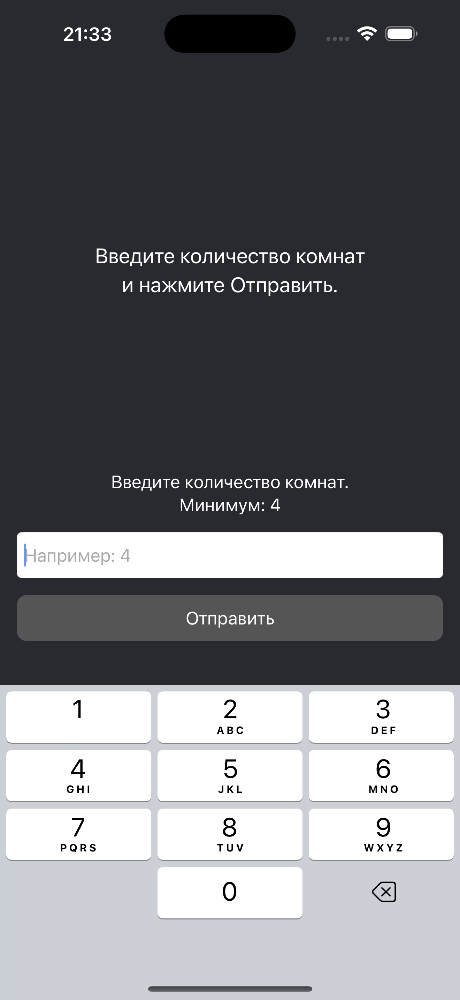
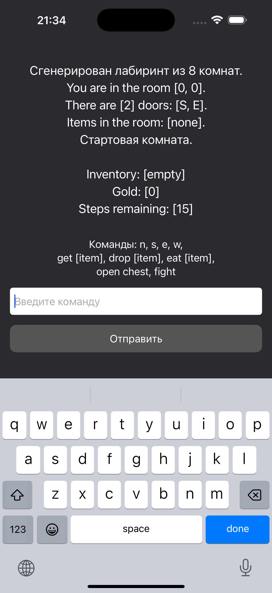
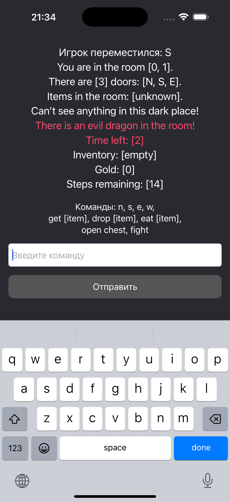
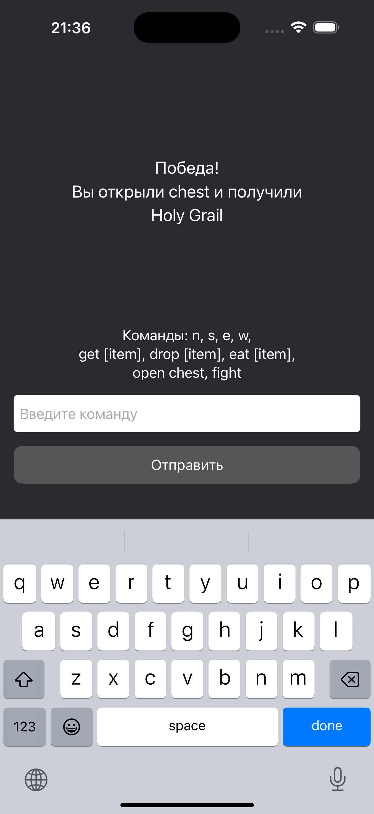

# CrystalDungeon

Test task iOS application written in Swift.

## 📱 Description

CrystalDungeon is a text-based adventure game where the player explores a generated labyrinth, collects items, and tries to find the treasure.

The game is implemented as an iOS application with a text-based interface.

## 🧠 Architecture

The project is built using the **MVP (Model-View-Presenter)** pattern:

- **View** — handles UI and user input  
- **Presenter** — processes input and communicates with the game engine  
- **Model / Engine** — contains core game logic  

## ⚙️ Features

- Procedural labyrinth generation  
- Movement between rooms (N, S, E, W)  
- Inventory system (get / drop items)  
- Key and chest mechanics  
- Win condition (finding the Grail)  

### Additional features:

- Dark rooms mechanic  
- Torchlight support  
- Food system (restores health)  
- Monster encounters with timer  
- Combat system (fight command)  
- Gold collection  
- Colored output for important events  

## 🛠 Technologies

- Swift
- UIKit
- MVP architecture

## 🚀 How to run

1. Open `CrystalDungeon.xcodeproj`
2. Run the project on simulator or device

## 📸 Screenshots

  
  

 

  
  

## 👤 Author

Evgenii Lukin
